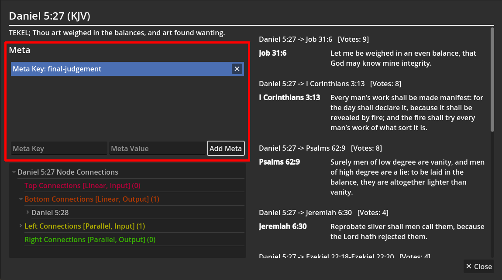

# Scrollmapper - Scripture Analysis Tool

Scrollmapper is a scripture analysis tool created with Godot 4. *Presently in the prototype phase. Major features are working.*

---

- Scrollmapper on **Steam** https://store.steampowered.com/app/3366380/Scrollmapper/
- Scrollmapper on **Reddit**: https://www.reddit.com/r/Scrollmapper/
- Scrollmapper **Discord**: https://discord.gg/g2XpvbXCSD
- Intro video: https://www.youtube.com/watch?v=EPIxNJ3A7FM

---

## Scrollmapper Documentation - Table of Contents:

- [Documentation Root](documentation/user/README.md)
- [Introduction](documentation/user/introduction.md)
- [Features](documentation/user/features.md)
- [Getting Started](documentation/user/getting_started.md)
- [Tutorial 1: Using the Node System](documentation/user/tutorials/tutorial_1.md)
- [Tutorial 2: Using Scrollmapper with Gephi](documentation/user/tutorials/tutorial_2.md)
- [Tutorial 3: Using Scrollmapper's Meta with Gephi's Attributes](documentation/user/tutorials/tutorial_3.md)

Scrollmapper is a scripture analysis tool designed to create detailed cross-references for canonical and apocryphal scriptures. It features a basic reader, a cross-reference viewing system, and a graphing method to illustrate complex relationships between books. Scrollmapper can export these relationships to [Gephi](https://gephi.org) for advanced analysis, allowing users to visualize and explore connections within the scriptures.

Other features are planned for Scrollmapper, such as plugin support.

Scrollmapper is available on Steam <link>.

If you wish to build from source, this should work "out of the box" as a Godot 4 project. It should export as a running app without any issues.

See the [Documentation](documentation/user/README.md).

## Gephi Integration

Scrollmapper exports cross-reference/graph data to [Gephi](https://gephi.org) for advanced analysis of scripture relationships.

## Screenshots

### Scrollmapper Screenshots:

#### Introduction

#### Book Library

#### Synchronize Library

#### Reader

#### Scrollmap

#### Meta Editing

#### Basic Scrollmap

#### Ezekiel Scrollmap

### Gephi Integration Screenshots

#### Detailed Gephi Integration

#### Gephi Data Laboratory Imported From Scrollmapper

#### Complex and Beautiful Cross-Reference Graphs

## License

MIT License

Permission is hereby granted, free of charge, to any person obtaining a copy
of this software and associated documentation files (the "Software"), to deal
in the Software without restriction, including without limitation the rights
to use, copy, modify, merge, publish, distribute, sublicense, and/or sell
copies of the Software, and to permit persons to whom the Software is
furnished to do so, subject to the following conditions:

The above copyright notice and this permission notice shall be included in all
copies or substantial portions of the Software.

THE SOFTWARE IS PROVIDED "AS IS", WITHOUT WARRANTY OF ANY KIND, EXPRESS OR
IMPLIED, INCLUDING BUT NOT LIMITED TO THE WARRANTIES OF MERCHANTABILITY,
FITNESS FOR A PARTICULAR PURPOSE AND NONINFRINGEMENT. IN NO EVENT SHALL THE
AUTHORS OR COPYRIGHT HOLDERS BE LIABLE FOR ANY CLAIM, DAMAGES OR OTHER
LIABILITY, WHETHER IN AN ACTION OF CONTRACT, TORT OR OTHERWISE, ARISING FROM,
OUT OF OR IN CONNECTION WITH THE SOFTWARE OR THE USE OR OTHER DEALINGS IN THE
SOFTWARE.
