# Scrollmapper - Tutorial 3: Using Scrollmapper's Meta with Gephi's Attributes

## Scrollmapper Verse Meta - Basics

In [Tutorial 1](tutorial_1.md), we discussed the basics of Scrollmapper. In [Tutorial 2](tutorial_2.md), we learned about Scrollmapper's integration with Gephi and some basics of using Gephi.

Here, we will discuss how to create verse meta in Scrollmapper, which can be exported and recognized as attributes in Gephi. Additionally, we will learn how to create these attributes directly in Gephi.

> **NOTE** Scrollmapper's meta feature works with Gephi but is also intended for future developments, such as user notes, highlighting, other software exports, etc.

## Creating Verse Meta in Scrollmapper

Verse meta in Scrollmapper allows you to add custom attributes to verses, which can be very useful for filtering and analyzing data in Gephi.

There are **3** methods to edit **Verse Meta** in Scrollmapper:

- **Main Meta Editor**: This is for mass-editing verse, book, and translation meta. *Only verse meta works at this time*. Book and translation meta are for future development.
- **VX Editor - Node Info View**: When you double-click a node, a node info window will appear. You can edit its meta here directly.
- **VX Editor - Meta Screen**: For editing verse meta on the active graph itself.

In short:

- Use the **Main Meta Editor** for mass-edits of verse meta outside of the VX Editor.
- Use the **VX Editor - Node Info View** for single-verse edits relevant to the node layout, and **VX Editor - Meta Screen** for multiple-verse edits relevant to the node layout.

### **Main Meta Editor**

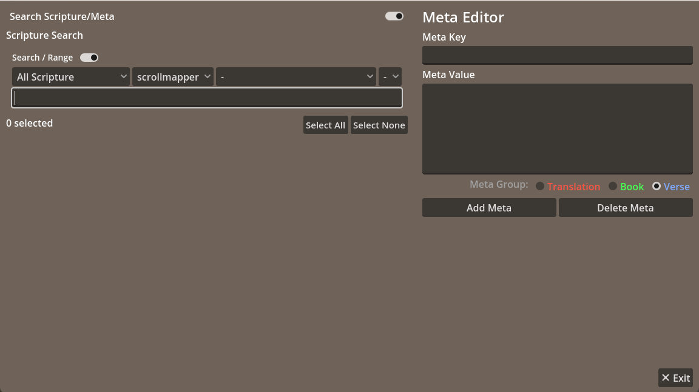

### **VX Editor - Node Info View**

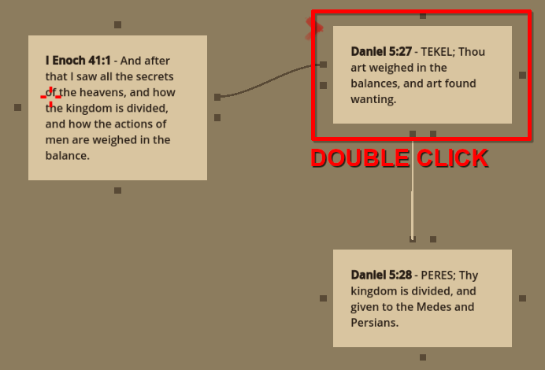

### **VX Editor - Meta Screen**

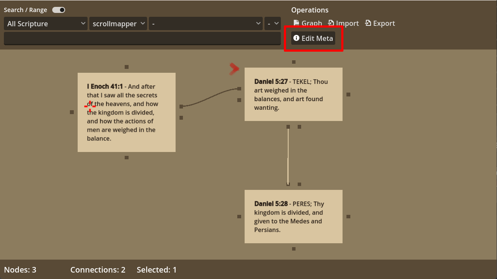

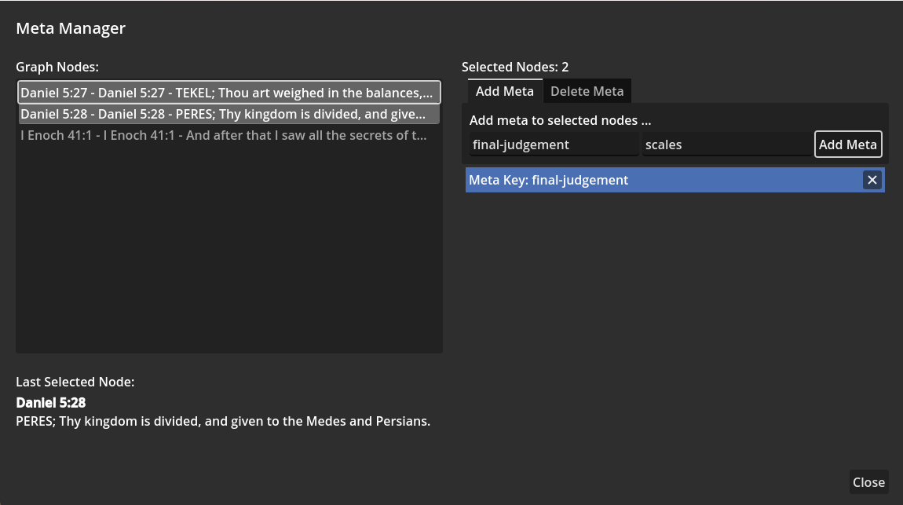

## Why Use Verse Meta?

Primarily, **verse meta** was implemented for creating **Gephi Attributes** ahead of time. This is its main use now. An example would be isolating a theme in a certain scripture thread you are researching, and then tagging that theme with relevant meta.

Upon exporting to Gephi, you are given the option to include this meta.

Secondarily, it was added as an anticipatory measure for the future of Scrollmapper.

### Use Cases for Verse Meta

Examples:
- In researching the [Great Harlot](https://en.wikipedia.org/wiki/Whore_of_Babylon), you may wish to tag all relevant verses with the `Meta Key` **great-whore** and the `Meta Value` **\<Specific Nuance\>**.
- In researching roles and occurrences of bible characters, you may create `Meta Key` **character** with `Meta Value` **\<Character Name\>**.
- And with increased experience/knowledge in Gephi, you will likely find even more ways to use Verse Meta as you design networks ahead of time in Scrollmapper.

> **NOTE** Meta is recognized universally in Scrollmapper. Adding meta to a verse in any of the editors will cause that meta to show up in the verses wherever they are used. Meta is only used, however, when you specify it during export.

## Editing Meta

### Using the Main Meta Editor

This main editor will be useful for mass-editing verses for export to Gephi. It does not require the VX Node Editor.

This main editor requires some explanation, as it may not seem obvious at first how it is used.

Here is how things look after you do a *text search*:

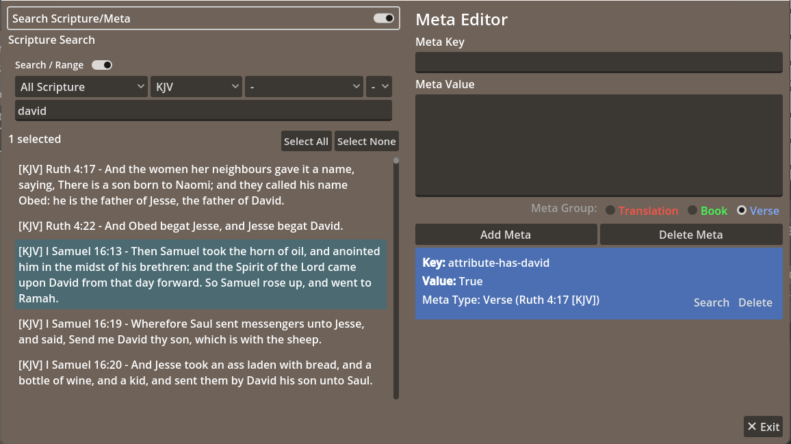

Here is how things look if you toggle the top radio button to do a *meta search*:

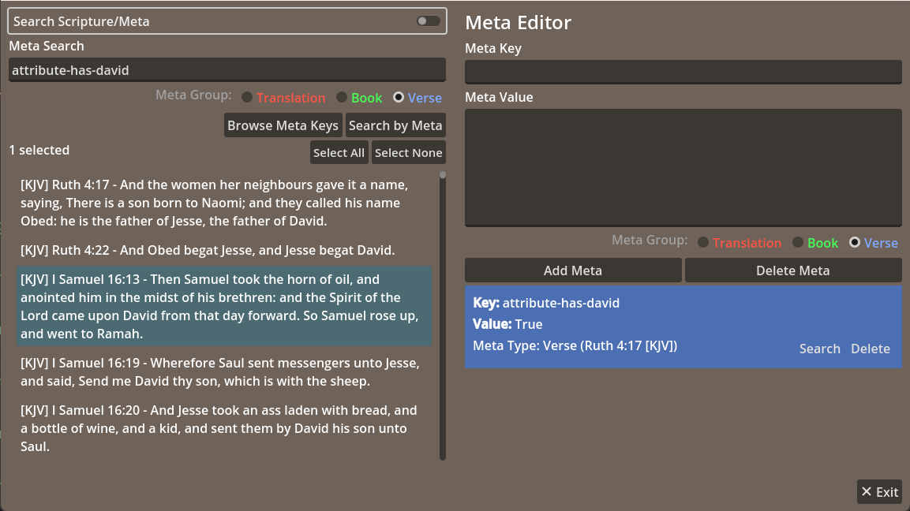

In the above two examples, you see:

- Verses have been searched by means of text.
- Verses have been searched by means of meta added to them.

You can select any verses you wish and then add meta via the controls on the right side of the interface, as follows:

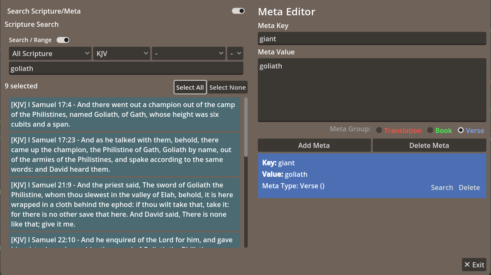

In the above image, you can see that we have searched **Goliath** and added the `Meta Key` **giant** and `Meta Value` **Goliath** to all selected verses.

It is a fairly simple operation. You could find all mentions of Giants in the canonical and non-canonical scriptures and tag them accordingly for some Gephi research project.

What if you need to find all verses tagged with **giant**? You can now do a reverse-lookup. Toggle the radio button `Search Scripture/Meta` above and search by Meta:

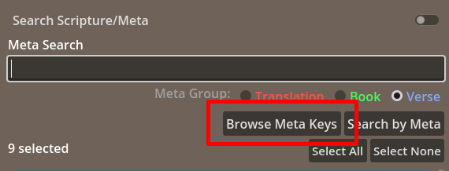

Clicking the `Browse Meta Keys` button will bring up this interface:

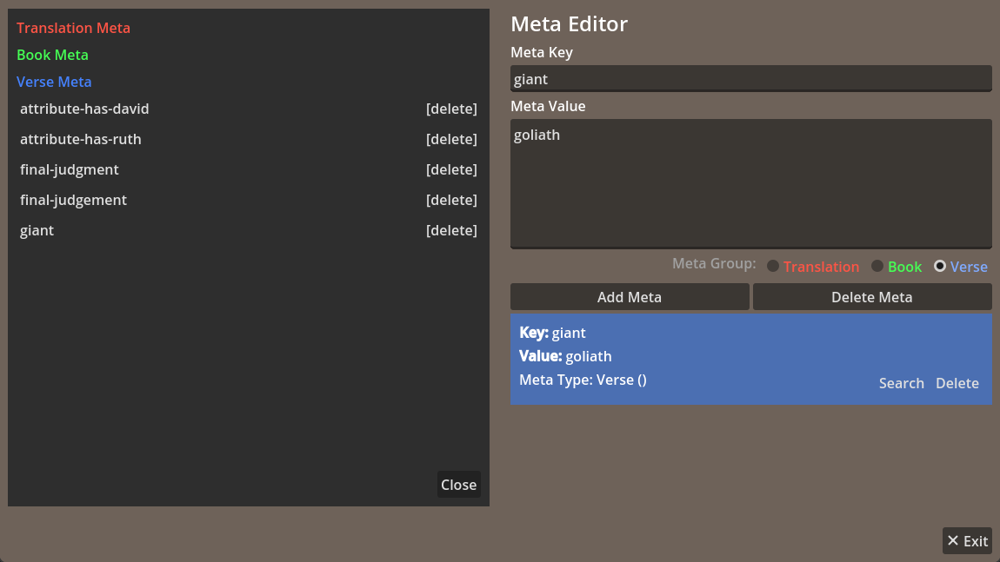

Notice how **goliath** is now among the meta keys. **Clicking it** will cause it to be inserted into the `Meta Search` box. Pushing `Search by Meta` will search all verses with that meta key, and provide them in the list below.

### Adding Meta / Deleting Meta in the Main Meta Editor

- `Add Meta` will add the Meta Key/Value to all verses that you selected on the left.
- `Delete Meta` will delete the meta with the key specified in the `Meta Key` field above from the verses that you selected on the left. For example, if you type **goliath** into the `Meta Key` field above and select 2 verses that contain that meta key, it will delete that meta from those two verses only.
- When selecting a verse, you will see its meta shown on the right, in the light-blue boxes. There is a `Delete` option in every box. That will delete the meta for **that selected verse** only.
- Do you wish to delete ALL META by key? That is done using the `Search by Meta` button. CAUTION: It will not give you a warning before mass-deleting the meta key you specify to delete.

### Editing Meta in VX Node Editor

Editing meta keys/values in the VX Editor should be self-explanatory, as the options are straightforward, following a similar pattern as shown above in the main editor.

- To edit verse meta by node, double-click the node. The interface will pop up, and you can add it there. Entries can be deleted there as well.
- To edit multiple verse meta, click the `Edit Meta` button in the VX Editor. Any nodes you have selected will be selected in the interface that pops up (And you can change the selection after it pops up as well). Deleting meta follows the same pattern as shown above in the **Main Meta Editor**.

## Exporting Meta as Gephi Attributes

By choosing `Export -> Export Cross-references Database to Gephi` you will be presented with the export options, and which meta items you will export:

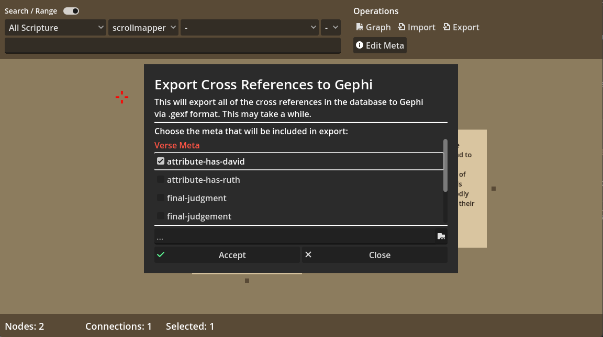

Here we have chosen to export the Meta Key **attribute-has-david** (The values were simply **True** in this case, but you can assign meta keys/values according to your own needs).

Here is how it shows up in the `Data Laboratory` in Gephi:

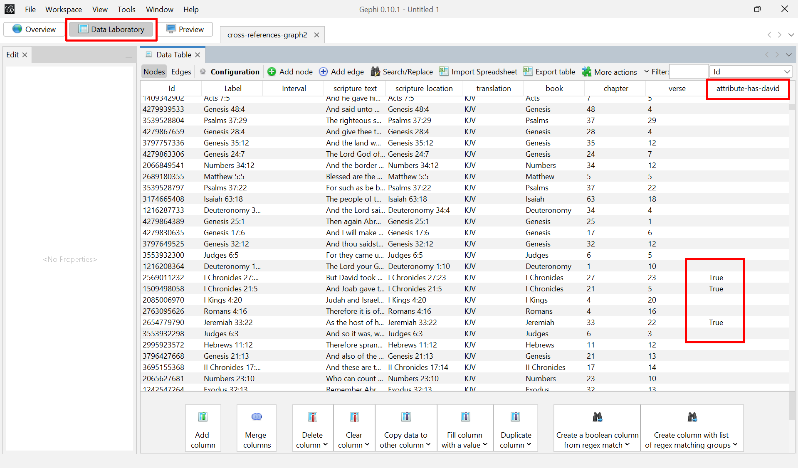

## Adding Attributes in Gephi Only

**Attributes can be added in Gephi** without the use of Scrollmapper.

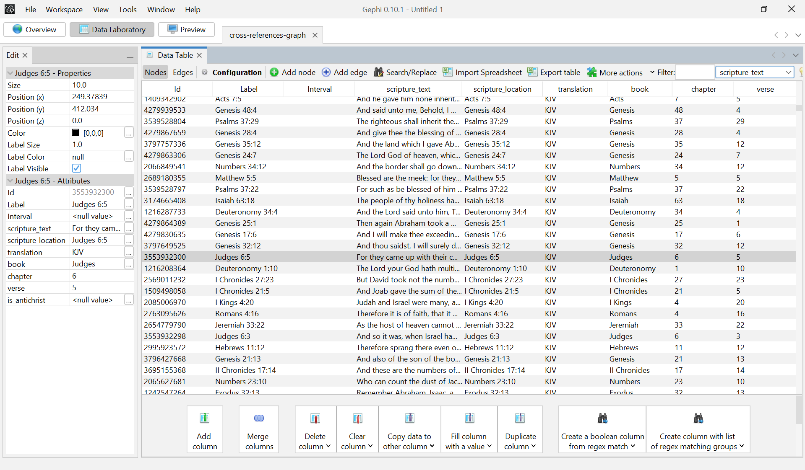

To do so:

- In the data laboratory, press the `Add Column` button.
- Name the Column according to your wishes.
- Next, in the `Filter` option (top bar), filter by `scripture_text`, and multi-select all the nodes/rows you wish to operate on.
- With the selection active, **Right Click** the nodes/rows and choose the option at the top: `Edit All Nodes`.
- On the LEFT `Edit` panel, you will see `Various Nodes - Properties` with editable properties.
- Find the named column you have just created in that properties list.
- Click the `...` to bring up an editing window.
- Type/Paste whatever content you wish into that input box and push OK.
- Now the attribute you just created will be assigned to those selected rows.

This is an alternative to assigning meta in Scrollmapper - whether you assign meta in Scrollmapper or Attributes in Gephi is completely based on your own preferences and workflows.

## Scrollmapper Documentation -Table of Contents:

- [ROOT](README.md)
- [Introduction](introduction.md)
- [Features](features.md)
- [Getting Started](getting_started.md)
- [Tutorial 1: Using the Node System](tutorials/tutorial_1.md)
- [Tutorial 2: Using Scrollmapper with Gephi](tutorials/tutorial_2.md)
- [Tutorial 3: Using Scrollmapper's Meta with Gephi's Attributes](tutorials/tutorial_3.md)